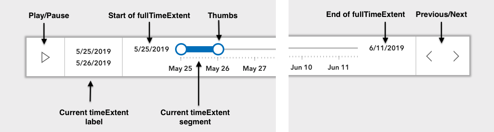
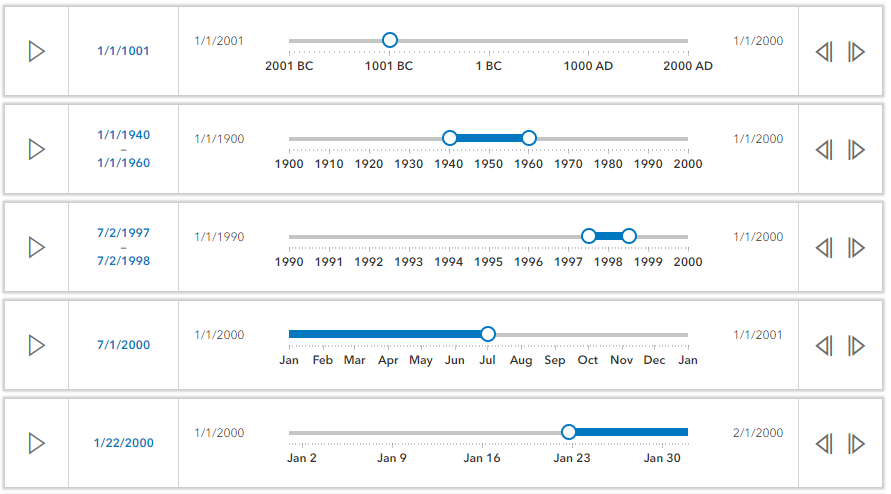

<!-- .slide: data-background="../../reveal.js/img/2019/uc/bg-1.png" -->

<h1 style="font-size: 60px;">Interactive Client-Side Mapping<br>with the ArcGIS API for JavaScript</h1>
<p style="font-size: 30px;">Kristian Ekenes [<a href="https://github.com/kekenes">@kekenes</a>] | Richie Carmichael [<a href="https://github.com/kiwiRichie">@kiwiRichie</a>]</p>
<p style="font-size: 30px;"><code><a href="https://git.io/fjr3N">https://git.io/fjr3N</a> (<a href="?print-pdf">printer friendly</a>)</code></p>

---

<!-- .slide: data-background="../../reveal.js/img/2019/uc/bg-2.png" -->
### Agenda

- Layers and Layer Views
- Client-side queries
- Time
- Filters & Effects
- Updating Renderers
- Widgets and charts

---

<!-- .slide: data-background="../../reveal.js/img/2019/uc/bg-3.png" -->

### Layers and Layer Views

---

<!-- .slide: data-background="../../reveal.js/img/2019/uc/bg-2.png" -->
### Layers and Layer Views

- Server-side
  - _(fetch or stream features on demand)_
  - FeatureLayer
  - SceneLayer
- Client-side
  - _(fetch all features at once)_
  - CSVLayer
  - GeoJSONLayer
  - FeatureLayer (from feature collection)

---

<!-- .slide: data-background="../../reveal.js/img/2019/uc/bg-2.png" -->
### Client-side query

You can work with the data from all these layers client-side using the same query APIs!

- `(CSV|GeoJSON)Layer`
- `(CSV|GeoJSON|Feature|Scene)LayerView`
  - `queryFeatures()`
  - `queryFeatureCount()`
  - `queryObjectIds()`
  - `queryExtent()`

[Age Pyramid](https://developers.arcgis.com/javascript/latest/sample-code/featurelayerview-query-geometry/live/index.html), 
[Homicides](https://developers.arcgis.com/javascript/latest/sample-code/featurelayerview-query-distance/live/index.html), 
[3D buildings](https://developers.arcgis.com/javascript/latest/sample-code/layers-scenelayerview-query-stats/live/index.html)

---

<!-- .slide: data-background="../../reveal.js/img/2019/uc/bg-2.png" -->
### Client-side query

- Features aren't always as they seem!
  - Quantized/generalized geometries in FeatureLayer
  - Very small features may not be present even if technically within the view's extent

[Query neighbors](https://ekenes.github.io/esri-ts-samples/query/neighbor-comparison/touches.html)

---

<!-- .slide: data-background="../../reveal.js/img/2019/uc/bg-2.png" -->
#### Client-side layers

```js
const url = "https://earthquake.usgs.gov/earthquakes/feed/v1.0/"
const geoJSONLayer = new GeoJSONLayer({
  url: url + "summary/all_month.geojson",
  copyright: "USGS Earthquakes"
});
const csvLayer = new CSVLayer({
  url: url + "summary/2.5_week.csv",
  copyright: "USGS Earthquakes"
});
```
```js
const featureLayer = new FeatureLayer({
  source: [
    new Graphic({ attributes: { myOid: 1 }, geometry: { ... } })
    new Graphic({ attributes: { myOid: 2 }, geometry: { ... } })
    new Graphic({ attributes: { myOid: 3 }, geometry: { ... } })
  ],
  fields: [
    new Field({
      name: "myOid",
      type: "oid"
    })
  ]
});
```

---

<!-- .slide: data-background="../../reveal.js/img/2019/uc/bg-2.png" -->
#### Client-side vs. Server-side

```js
// Query all data on the server.
var query = new Query({
  where: "magnitude >= 5"
});
```
```js
// Query all data on the server.
featureLayer.queryFeatureCount(query).then(function(count){
  console.log(`${count} quakes found.`);  // 54820 quakes found.
});
```
```js
// Query only data downloaded to the browser.
featureLayerView.queryFeatureCount(query).then(function(count){
  console.log(`${count} quakes found.`);  // 9235 quakes found.
});
```

---

<!-- .slide: data-background="../../reveal.js/img/2019/uc/bg-2.png" -->
### About Time!

- Time Support @ [4.12](https://developers.arcgis.com/javascript/)
  - Query.[timeExtent](https://developers.arcgis.com/javascript/latest/api-reference/esri-tasks-support-Query.html#timeExtent)
  - [FeatureLayer](https://developers.arcgis.com/javascript/latest/api-reference/esri-layers-FeatureLayer.html), [ImageryLayer](https://developers.arcgis.com/javascript/latest/api-reference/esri-layers-ImageryLayer.html), [MapImageLayer](https://developers.arcgis.com/javascript/latest/api-reference/esri-layers-MapImageLayer.html), [CSVLayer](https://developers.arcgis.com/javascript/latest/api-reference/esri-layers-CSVLayer.html) and [GeoJSONLayer](https://developers.arcgis.com/javascript/latest/api-reference/esri-layers-GeoJSONLayer.html)
  - [MapView.timeExtent](https://developers.arcgis.com/javascript/latest/api-reference/esri-views-MapView.html#timeExtent) & [SceneView.timeExtent](https://developers.arcgis.com/javascript/latest/api-reference/esri-views-SceneView.html#timeExtent)
  - [TimeSlider](https://developers.arcgis.com/javascript/latest/api-reference/esri-widgets-TimeSlider.html) widget

- Time Support @ [3.29](https://developers.arcgis.com/javascript/3/)
  - Time [offsets](https://developers.arcgis.com/javascript/3/jsapi/layertimeoptions-amd.html#timeoffset), [temporal](https://developers.arcgis.com/javascript/3/jsapi/temporalrenderer-amd.html) renderer

---

<!-- .slide: data-background="../../reveal.js/img/2019/uc/bg-2.png" -->
### Filters and Effects

- Filter - _Client-side spatial/aspatial/temporal filtering._

```js
// Only show earthquakes that occured between 2000 and 2006.
featureLayerView.filter = new FeatureFilter({
  timeExtent: new TimeExtent({
    start: new Date(2000, 0, 1),
    end: new Date(2007, 0, 1)
  })
});
```
- Effects - <span style="font-size: 35px;">_Visual effects applied to included/excluded features._</span>

```js
// Show quakes less than 7 magnitude as faint shadows.
featureLayerView.effect = new FeatureEffect({
  filter: {
    where: "magnitude >= 7"
  }
  excludedEffect: "grayscale(100%) opacity(0.5)"
});
```

---

<!-- .slide: data-background="../../reveal.js/img/2019/uc/bg-4.png" -->
### Demo

- Time, Filters and Effects - [The Trifecta](demos/earthquakes-july-2019-2d.html)

---

<!-- .slide: data-background="../../reveal.js/img/2019/uc/bg-2.png" -->
#### TimeSlider Components



---

<!-- .slide: data-background="../../reveal.js/img/2019/uc/bg-2.png" -->
#### TimeSlider Properties

```js
var timeSlider = new TimeSlider({
  container: "timeSliderDiv",     // HTML node
  fullTimeExtent: { start, end }, // Temporal width
  // optional
  mode: "time-window",            // Handle configuration
  playRate: 1000,                 // Play speed
  stops: {                        // Handle stops/steps
    interval: { value: 1, unit: "years" }
  },
  loop: true,                     // Allow looping
  timeVisible: false,             // Show times
  values: [ first, second ],      // Handle positions
  view: view                      // The MapView/SceneView
});
```

---

<!-- .slide: data-background="../../reveal.js/img/2019/uc/bg-2.png" -->
#### TimeSlider Modes
<span style="font-size: 24px">instant | time-window | cumulative-from-start | cumulative-from-end<span>


---

<!-- .slide: data-background="../../reveal.js/img/2019/uc/bg-2.png" -->
#### TimeSlider Stops

```js
const timeSlider = new TimeSlider({
  stops: {
    count: 10 // Create ten evenly spaced stops.
  }
});
```
```js
const timeSlider = new TimeSlider({
  stops: {
    interval: { // Create stops spaced one year apart.
      value: 1,
      unit: "years"
    }
  }
});
```

```js
const timeSlider = new TimeSlider({
  stops: {
    dates: [ // Explicitly create stops at these dates.
      new Date(2000, 0, 1), new Date(2001, 3, 8),
      new Date(2003, 12, 8), new Date(2004, 2, 19)
    ]
  }
});
```

---

<!-- .slide: data-background="../../reveal.js/img/2019/uc/bg-2.png" -->
#### Filter

```js
// Only show earthquakes with a magnitude of 7 or greater.
featureLayerView.filter = new FeatureFilter({
  where: "magnitude >= 7"
});
```
```js
// Only show buildings within 10 miles of the mouse cursor.
mapView.on("pointer-move", function(e) {
  buildingLayerView.filter = {
    geometry: mapView.toMap({e.x, e.y}),
    distance: 10,
    units: "miles"
  }
});
```
<span style="font-size: 24px">[API Reference](https://developers.arcgis.com/javascript/latest/api-reference/esri-views-layers-support-FeatureFilter.html)
| [filter by attribute sample](https://developers.arcgis.com/javascript/latest/sample-code/featurefilter-attributes/index.html)
| [filter by geometry sample](https://developers.arcgis.com/javascript/latest/sample-code/layers-scenelayer-feature-masking/index.html)</span>

---

<!-- .slide: data-background="../../reveal.js/img/2019/uc/bg-2.png" -->
### Effects

```js
// Show quakes less than 7 magnitude as faint shadows.
featureLayerView.effect = new FeatureEffect({
  filter: {
    where: "magnitude >= 7"
  }
  excludedEffect: "grayscale(100%) opacity(0.5)"
});
```
```css
// brightness(0.4);
// contrast(200%);
// grayscale(50%);
// hue-rotate(90deg);
// invert(75%);
// opacity(25%);
// saturate(30%);
// sepia(60%);
```
<span style="font-size: 24px">[CSS reference](https://developer.mozilla.org/en-US/docs/Web/CSS/filter)
| [CSS filter parser](https://github.com/ycabon/css-filter-parser)
| [API Reference](https://developers.arcgis.com/javascript/latest/api-reference/esri-views-layers-support-FeatureEffect.html)
| [Plenary Demo](https://ycabon.github.io/2019-devsummit-plenary/3_filter_effect.html)</span>

---

<!-- .slide: data-background="../../reveal.js/img/2019/uc/bg-2.png" -->
### Wait, there's more.

- [A century of Earthquakes](demos/earthquake-client-side-2d.html)
- [May/June Quakes](demos/earthquakes-may-june-2019-2d.html)
- [Hurricanes and Storms](demos/hurricanes-and-storms-2d.html)
- [Imagery with Time](demos/imagelayerview-with-time-2d.html)
- [MapServer with Time](demos/mapimagelayerview-with-time-2d.html)
- [Quakes in 3d](https://ycabon.github.io/earthquakes/)

---

<!-- .slide: data-background="../../reveal.js/img/2019/uc/bg-2.png" -->
### Updating renderers

- Update a visual variable
  - color, size, opacity, rotation
- Update a data value or expression
  - Field name
  - Arcade expression

<span style="font-size:30px">[Population Density by race/ethnicity](https://ekenes.github.io/conferences/ds-2019/plenary/dot-density-legend/index.html) | [Housing density by decade](https://ekenes.github.io/conferences/ds-2019/plenary/dot-density-housing/index.html)<br/>[Median household income](https://developers.arcgis.com/javascript/latest/sample-code/visualization-histogram-color/live/index.html) | [Temperature anomaly](https://developers.arcgis.com/javascript/latest/sample-code/visualization-update-data/live/index.html) | [Population change](https://ekenes.github.io/conferences/uc-2019/interactive-apps/demos/pop-change.html)</span>

---

<!-- .slide: data-background="../../reveal.js/img/2019/uc/bg-2.png" -->
#### Histogram

```ts
// esri/renderers/smartMapping/statistics/histogram
const result = await histogram({
  layer: layer,
  field: "temp",
  numBins: 100
});

// esri/widgets/Histogram
const histogramWidget = Histogram.fromHistogramResult(result);
histogramWidget.container = "histogram";
```
<span style="font-size:24px">[Basic Histogram](https://ekenes.github.io/conferences/uc-2019/interactive-apps/demos/histogram/basic.html)</span>

---

<!-- .slide: data-background="../../reveal.js/img/2019/uc/bg-2.png" -->
#### HistogramRangeSlider <span style="font-size:24px">[(sample)](https://ekenes.github.io/conferences/uc-2019/interactive-apps/demos/histogram-range-slider/filter.html)</span>

```ts
// esri/renderers/smartMapping/statistics/histogram
const histogramResult = await histogram({
  layer: layer,
  field: "temp",
  numBins: 100
});
```
```ts
// esri/widgets/HistogramRangeSlider
const durationSlider = new HistogramRangeSlider({
  bins: histogramResult.bins,
  min: histogramResult.min,
  max: histogramResult.max,
  values: [histogramResult.min, histogramResult.max],
  rangeType: "between",
  container: document.getElementById("slider-container")
});
```
```ts
durationSlider.on(["value-change", "values-change"], function(event) {
  layerView.filter = {
    where: durationSlider.generateWhereClause("temp")
  };
});
```

---

<!-- .slide: data-background="../../reveal.js/img/2019/uc/bg-5.png" -->

---

<!-- .slide: data-background="../../reveal.js/img/2019/uc/bg-3.png" -->

