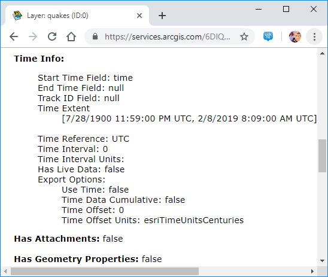
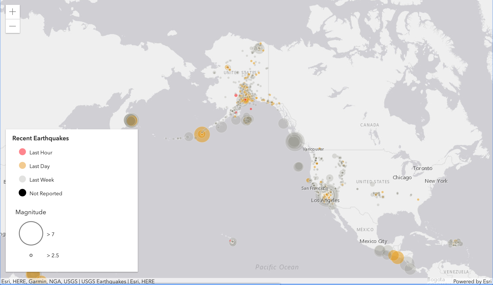
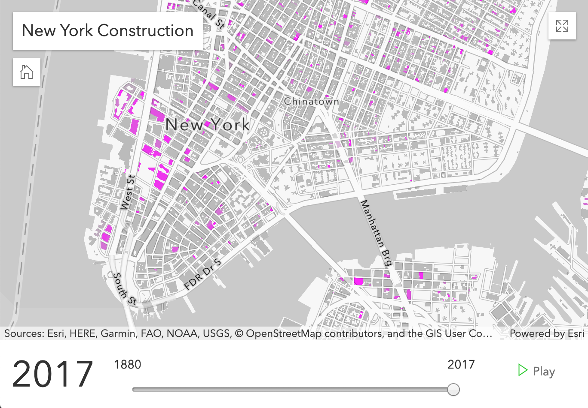

<!-- .slide: data-background="../../reveal.js/img/2019/uc/bg-1.png" -->

<h1 style="font-size: 60px;">Visualizing Temporal Data<br>with the ArcGIS API for JavaScript</h1>
<p style="font-size: 24px;">Yann Cabon [<a href="https://github.com/yanncabon">@yanncabon</a>] | Richie Carmichael [<a href="https://github.com/kiwiRichie">@kiwiRichie</a>]</a></p>
<p style="font-size: 30px;"><code><a href="https://git.io/fjrzO">https://git.io/fjrzO</a> (<a href="?print-pdf">printer friendly</a>)</code></p>

---

<!-- .slide: data-background="../../reveal.js/img/2019/uc/bg-2.png" -->
### Agenda

- Time, Filters and Effects
  - Status of Time Support
  - Configuring Temporal Content
  - Time-based Queries
  - Filters and Effects
  - TimeSlider widget
- Visualizing time using Arcade
- Visualizing time using Visual Variables

---

<!-- .slide: data-background="../../reveal.js/img/2019/uc/bg-2.png" -->
### About Time!

- Time Support @ [4.12](https://developers.arcgis.com/javascript/)
  - Query.[timeExtent](https://developers.arcgis.com/javascript/latest/api-reference/esri-tasks-support-Query.html#timeExtent)
  - [FeatureLayer](https://developers.arcgis.com/javascript/latest/api-reference/esri-layers-FeatureLayer.html), [ImageryLayer](https://developers.arcgis.com/javascript/latest/api-reference/esri-layers-ImageryLayer.html), [MapImageLayer](https://developers.arcgis.com/javascript/latest/api-reference/esri-layers-MapImageLayer.html), [CSVLayer](https://developers.arcgis.com/javascript/latest/api-reference/esri-layers-CSVLayer.html) and [GeoJSONLayer](https://developers.arcgis.com/javascript/latest/api-reference/esri-layers-GeoJSONLayer.html)
  - [MapView.timeExtent](https://developers.arcgis.com/javascript/latest/api-reference/esri-views-MapView.html#timeExtent) & [SceneView.timeExtent](https://developers.arcgis.com/javascript/latest/api-reference/esri-views-SceneView.html#timeExtent)
  - [TimeSlider](https://developers.arcgis.com/javascript/latest/api-reference/esri-widgets-TimeSlider.html) widget

- Time Support @ [3.29](https://developers.arcgis.com/javascript/3/)
  - Time [offsets](https://developers.arcgis.com/javascript/3/jsapi/layertimeoptions-amd.html#timeoffset), [temporal](https://developers.arcgis.com/javascript/3/jsapi/temporalrenderer-amd.html) renderer

---

<!-- .slide: data-background="../../reveal.js/img/2019/uc/bg-2.png" -->
### Publishing Temporal Content

- ArcGIS PRO
  - [Set the time properties on data](https://pro.arcgis.com/en/pro-app/help/mapping/time/set-the-time-properties-on-data.htm)
  - [Share as web layer](https://pro.arcgis.com/en/pro-app/help/sharing/overview/introduction-to-sharing-web-layers.htm)

---

<!-- .slide: data-background="../../reveal.js/img/2019/uc/bg-2.png" -->
### TimeInfo

<span style="font-size: 30px">Time-aware feature and imagery services require a **TimeInfo** definition.</span>



---

<!-- .slide: data-background="../../reveal.js/img/2019/uc/bg-2.png" -->
#### Defining TimeInfo in Client-Side Layers

```js
// Create a layer from a CSV file.
const layer = new CSVLayer({
  url: "ridgecrest-july-2019.csv",
  // Specific geographic fields.
  longitudeField: "longitude",
  latitudeField: "latitude",
  // Specify temporal field.
  timeInfo: {
    startField: "time",
    interval: {
      value: 1,
      unit: "hours"
    }
  }
});
```

---

<!-- .slide: data-background="../../reveal.js/img/2019/uc/bg-2.png" -->
### Time-based Queries
```js
var query = new Query({
  timeExtent: new TimeExtent({
    start: new Date(2000, 0, 1),
    end: new Date(2007, 0, 1)
  })
});
```
```js
// Search all features!
var extent   = await featureLayer.queryExtent(query);
var count    = await featureLayer.queryFeatureCount(query)
var features = await featureLayer.queryFeatures(query)
var ids      = await featureLayer.queryObjectIds(query)
```
```js
// Only search features downloaded to the browser.
var extent   = await featureLayerView.queryExtent(query);
var count    = await featureLayerView.queryFeatureCount(query)
var features = await featureLayerView.queryFeatures(query)
var ids      = await featureLayerView.queryObjectIds(query)
```

---

<!-- .slide: data-background="../../reveal.js/img/2019/uc/bg-2.png" -->
### Filters and Effects

- Filter - _Client-side spatial/aspatial/temporal filtering._

```js
// Only show earthquakes that occured between 2000 and 2006.
featureLayerView.filter = new FeatureFilter({
  timeExtent: new TimeExtent({
    start: new Date(2000, 0, 1),
    end: new Date(2007, 0, 1)
  })
});
```
- Effects - <span style="font-size: 35px;">_Visual effects applied to included/excluded features._</span>

```js
// Show quakes less than 7 magnitude as faint shadows.
featureLayerView.effect = new FeatureEffect({
  filter: {
    where: "magnitude >= 7"
  }
  excludedEffect: "grayscale(100%) opacity(0.5)"
});
```

---

<!-- .slide: data-background="../../reveal.js/img/2019/uc/bg-4.png" -->
### Demo

- Time, Filters and Effects - [The Trifecta](demos/earthquakes-july-2019-2d.html)

---

<!-- .slide: data-background="../../reveal.js/img/2019/uc/bg-2.png" -->
#### TimeSlider Components


---

<!-- .slide: data-background="../../reveal.js/img/2019/uc/bg-2.png" -->
#### TimeSlider Properties

```js
var timeSlider = new TimeSlider({
  container: "timeSliderDiv",     // HTML node
  fullTimeExtent: { start, end }, // Temporal width
  // optional
  mode: "time-window",            // Handle configuration
  playRate: 1000,                 // Play speed
  stops: {                        // Handle stops/steps
    interval: { value: 1, unit: "years" }
  },
  loop: true,                     // Allow looping
  timeVisible: false,             // Show times
  values: [ first, second ],      // Handle positions
  view: view                      // The MapView/SceneView
});
```

---

<!-- .slide: data-background="../../reveal.js/img/2019/uc/bg-2.png" -->
#### TimeSlider Modes
<span style="font-size: 24px">instant | time-window | cumulative-from-start | cumulative-from-end<span>


---

<!-- .slide: data-background="../../reveal.js/img/2019/uc/bg-2.png" -->
#### TimeSlider Stops

```js
const timeSlider = new TimeSlider({
  stops: {
    count: 10 // Create ten evenly spaced stops.
  }
});
```
```js
const timeSlider = new TimeSlider({
  stops: {
    interval: { // Create stops spaced one year apart.
      value: 1,
      unit: "years"
    }
  }
});
```

```js
const timeSlider = new TimeSlider({
  stops: {
    dates: [ // Explicitly create stops at these dates.
      new Date(2000, 0, 1), new Date(2001, 3, 8),
      new Date(2003, 12, 8), new Date(2004, 2, 19)
    ]
  }
});
```

---

<!-- .slide: data-background="../../reveal.js/img/2019/uc/bg-2.png" -->
### Filter

```js
// Only show earthquakes with a magnitude of 7 or greater.
featureLayerView.filter = new FeatureFilter({
  where: "magnitude >= 7"
});
```
```js
// Only show buildings within 10 miles of the mouse cursor.
mapView.on("pointer-move", function(e) {
  buildingLayerView.filter = {
    geometry: mapView.toMap({e.x, e.y})
    distance: 10,
    units: "miles"
  }
});
```
<span style="font-size: 24px">[API Reference](https://developers.arcgis.com/javascript/latest/api-reference/esri-views-layers-support-FeatureFilter.html)
| [filter by attribute sample](https://developers.arcgis.com/javascript/latest/sample-code/featurefilter-attributes/index.html)
| [filter by geometry sample](https://developers.arcgis.com/javascript/latest/sample-code/layers-scenelayer-feature-masking/index.html)</span>

---

<!-- .slide: data-background="../../reveal.js/img/2019/uc/bg-2.png" -->
### Effects

```js
// Show quakes less than 7 magnitude as faint shadows.
featureLayerView.effect = new FeatureEffect({
  filter: {
    where: "magnitude >= 7"
  }
  excludedEffect: "grayscale(100%) opacity(0.5)"
});
```
```css
// brightness(0.4);
// contrast(200%);
// grayscale(50%);
// hue-rotate(90deg);
// invert(75%);
// opacity(25%);
// saturate(30%);
// sepia(60%);
```
<span style="font-size: 24px">[CSS reference](https://developer.mozilla.org/en-US/docs/Web/CSS/filter)
| [CSS filter parser](https://github.com/ycabon/css-filter-parser)
| [API Reference](https://developers.arcgis.com/javascript/latest/api-reference/esri-views-layers-support-FeatureEffect.html)
| [Plenary Demo](https://ycabon.github.io/2019-devsummit-plenary/3_filter_effect.html)</span>

---

<!-- .slide: data-background="../../reveal.js/img/2019/uc/bg-3.png" -->

### Tips for client-side queries

- Wait for layer to be intialized and data downloaded
```js
view.whenLayerView(featureLayerQuake).then(function(lv){
    // Layer initalized.
    lv.watch("updating", function(value){
        if (!value){
            // Data finished downloading.
        }
    });
});
```
- Geometry may be generalized
- Restrict queries to data within visual extent

---

<!-- .slide: data-background="../../reveal.js/img/2019/uc/bg-3.png" -->
### What's coming with Time?

- Time Support @ 4.13
  - "opt-out" for layers</br>_(i.e. ignore View.timeExtent)_
  - Time offset</br>_(e.g. for analyzing yearly or seasonal trends)_
  - Responsive TimeSlider widget

---

<!-- .slide: data-background="../../reveal.js/img/2019/uc/bg-2.png" -->
### Wait, there's more.

- [A century of Earthquakes](demos/earthquake-client-side-2d.html)
- [May/June Quakes](demos/earthquakes-may-june-2019-2d.html)
- [Hurricanes and Storms](demos/hurricanes-and-storms-2d.html)
- [Imagery with Time](demos/imagelayerview-with-time-2d.html)
- [MapServer with Time](demos/mapimagelayerview-with-time-2d.html)
- [Quakes in 3d](https://ycabon.github.io/earthquakes/)

---

<!-- .slide: data-background="../../reveal.js/img/2019/uc/bg-3.png" -->
#### Visualizing time using Arcade</br>Color earthquakes by age

<a href="./demos/earthquakes-arcade.html" target="_blank">

---

<!-- .slide: data-background="../../reveal.js/img/2019/uc/bg-3.png" -->
#### Visualizing time using Visual Variables

<a href="./demos/animate_vv/animate_vv.1.html" target="_blank">

---

<!-- .slide: data-background="../../reveal.js/img/2019/uc/bg-5.png" -->

---

<!-- .slide: data-background="../../reveal.js/img/2019/uc/bg-3.png" -->

