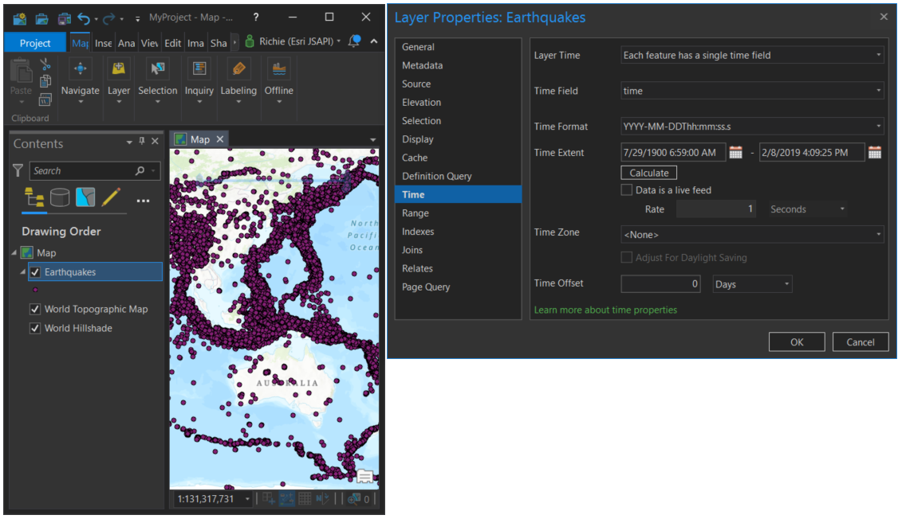
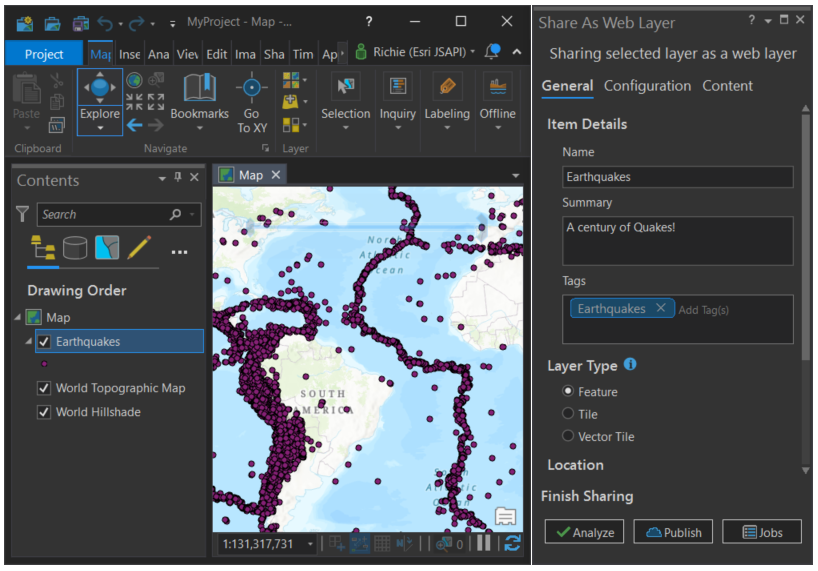
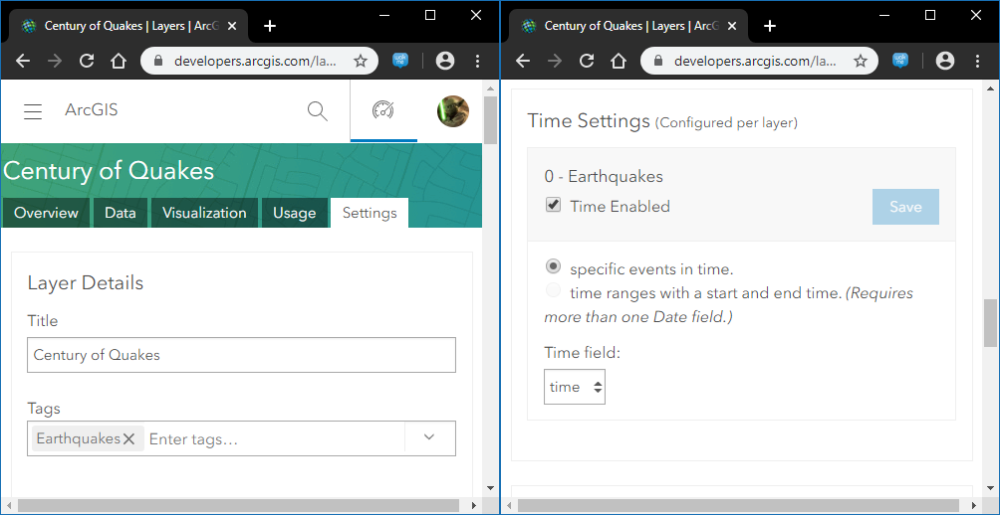
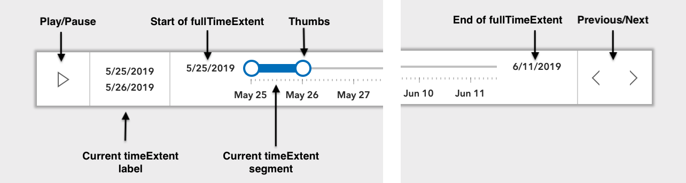

<!-- .slide: data-background="../../reveal.js/img/2020/devsummit/bg-4.png" -->

<h1 style="font-size: 60px;">Visualizing Temporal Data<br>with the ArcGIS API for JavaScript</h1>
<p style="font-size: 24px;">Thomas Other [<a href="mailto:tother@esri.com">tother@esri.com</a>] | Richie Carmichael [<a href="https://github.com/kiwiRichie">@kiwiRichie</a>]</a></p>
<p style="font-size: 30px;"><code><a href="https://git.io/JvB8W">https://git.io/JvB8W</a> (<a href="?print-pdf">printer friendly</a>)</code></p>

---

<!-- .slide: data-background="../../reveal.js/img/2020/devsummit/bg-2.png" -->
### Agenda

- Part 1
  - Overview of time support in JS 4
  - How to create temporal data and queries
  - Demonstrations
    - A century of quakes
    - Overlapping hurricanes
- Part 2

---

<!-- .slide: data-background="../../reveal.js/img/2020/devsummit/bg-2.png" -->
### About Time!

- Time Support @ [4.14](https://developers.arcgis.com/javascript/)
  - View<br/>MapView.[timeExtent](https://developers.arcgis.com/javascript/latest/api-reference/esri-views-MapView.html#timeExtent), SceneView.[timeExtent](https://developers.arcgis.com/javascript/latest/api-reference/esri-views-SceneView.html#timeExtent)

  - Layer<br/>[FeatureLayer](https://developers.arcgis.com/javascript/latest/api-reference/esri-layers-FeatureLayer.html), [ImageryLayer](https://developers.arcgis.com/javascript/latest/api-reference/esri-layers-ImageryLayer.html), [MapImageLayer](https://developers.arcgis.com/javascript/latest/api-reference/esri-layers-MapImageLayer.html), [CSVLayer](https://developers.arcgis.com/javascript/latest/api-reference/esri-layers-CSVLayer.html) and [GeoJSONLayer](https://developers.arcgis.com/javascript/latest/api-reference/esri-layers-GeoJSONLayer.html)

  - Query.[timeExtent](https://developers.arcgis.com/javascript/latest/api-reference/esri-tasks-support-Query.html#timeExtent)
  
  - [TimeSlider](https://developers.arcgis.com/javascript/latest/api-reference/esri-widgets-TimeSlider.html) widget

---

<!-- .slide: data-background="../../reveal.js/img/2020/devsummit/bg-2.png" -->
### Defining Time in Client-Side Layers

```js
// Create a layer from a CSV file
const layer = new CSVLayer({
  url: "ridgecrest-july-2019.csv",
  // Specific geographic fields
  longitudeField: "longitude",
  latitudeField: "latitude",
  // Specify temporal field
  timeInfo: {
    startField: "time",
    interval: {
      value: 1,
      unit: "hours"
    }
  }
});
```

---

<!-- .slide: data-background="../../reveal.js/img/2020/devsummit/bg-2.png" -->
### Defining Time in PRO



[Set the time properties on data](https://pro.arcgis.com/en/pro-app/help/mapping/time/set-the-time-properties-on-data.htm)

---

<!-- .slide: data-background="../../reveal.js/img/2020/devsummit/bg-2.png" -->
### Sharing is Caring



- [Share as web layer](https://pro.arcgis.com/en/pro-app/help/sharing/overview/introduction-to-sharing-web-layers.htm)

---

<!-- .slide: data-background="../../reveal.js/img/2020/devsummit/bg-2.png" -->
### [Oops, I forgot!](https://developers.arcgis.com/)



---

<!-- .slide: data-background="../../reveal.js/img/2020/devsummit/bg-2.png" -->
### Time-based Queries
```js
var query = new Query({
  timeExtent: new TimeExtent({
    start: new Date(2000, 0, 1),
    end: new Date(2007, 0, 1)
  })
});
```
```js
// Search all features!
var extent   = await featureLayer.queryExtent(query);
var count    = await featureLayer.queryFeatureCount(query)
var features = await featureLayer.queryFeatures(query)
var ids      = await featureLayer.queryObjectIds(query)
```
```js
// Only search features downloaded to the browser.
var extent   = await featureLayerView.queryExtent(query);
var count    = await featureLayerView.queryFeatureCount(query)
var features = await featureLayerView.queryFeatures(query)
var ids      = await featureLayerView.queryObjectIds(query)
```

---

<!-- .slide: data-background="../../reveal.js/img/2020/devsummit/bg-2.png" -->
### Filters and Effects

- Filter - _Client-side spatial/aspatial/temporal filtering._

```js
// Only show earthquakes that occured between 2000 and 2006.
featureLayerView.filter = new FeatureFilter({
  timeExtent: new TimeExtent({
    start: new Date(2000, 0, 1),
    end: new Date(2007, 0, 1)
  })
});
```
- Effects - <span style="font-size: 35px;">_Visual effects applied to included/excluded features._</span>

```js
// Show quakes less than 7 magnitude as faint shadows.
featureLayerView.effect = new FeatureEffect({
  filter: {
    where: "magnitude >= 7"
  }
  excludedEffect: "grayscale(100%) opacity(0.5)"
});
```

---

<!-- .slide: data-background="../../reveal.js/img/2020/devsummit/bg-2.png" -->
#### The TimeSlider Widget



---

<!-- .slide: data-background="../../reveal.js/img/2020/devsummit/bg-2.png" -->
#### TimeSlider Properties

```js
var timeSlider = new TimeSlider({
  container: "timeSliderDiv",     // HTML node
  fullTimeExtent: { start, end }, // Temporal width
  // optional
  mode: "time-window",            // Handle layout
  playRate: 1000,                 // Play speed
  stops: {                        // Handle stops/steps
    interval: { value: 1, unit: "years" }
  },
  loop: true,                     // Allow looping
  timeVisible: false,             // Show times
  values: [ first, second ],      // Handle positions
  view: view                      // The MapView/SceneView
});
```

---

<!-- .slide: data-background="../../reveal.js/img/2020/devsummit/bg-4.png" -->
### [Century of Quakes](demos/century-of-earthquakes.html)


---

<!-- .slide: data-background="../../reveal.js/img/2020/devsummit/bg-4.png" -->
### [Hurricanes](demos/hurricanes-with-offset-3d.html)


---

<!-- .slide: data-background="../../reveal.js/img/2020/devsummit/bg-4.png" -->
### [New York Construction (1880-2017)](demos/new-york-construction.html)


---

<!-- .slide: data-background="../../reveal.js/img/2020/devsummit/bg-2.png" -->
### Wait, there's more.

- [May/June Quakes](demos/earthquakes-may-june-2019-2d.html)
- [Hurricanes and Storms](demos/hurricanes-and-storms-2d.html)
- [Hurricane Trends (2d)](demos/hurricanes-with-offset-2d.html)
- [Imagery with Time](demos/imagelayerview-with-time-2d.html)
- [MapServer with Time](demos/mapimagelayerview-with-time-2d.html)
- [Recent Earthquakes (with Arcade)](demos/earthquakes-arcade.html)
- [Ridgecrest Earthquake (2019)](demos/earthquakes-july-2019-2d.html)

---

<!-- .slide: data-background="../../reveal.js/img/2020/devsummit/bg-rating.png" -->

---

<!-- .slide: data-background="../../reveal.js/img/2020/devsummit/bg-3.png" -->

